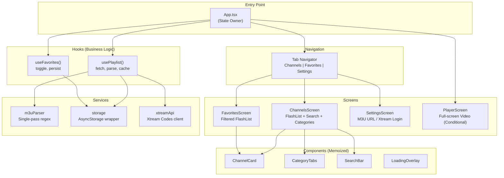

# FOR_ME.md — IPTV Player

## 1. The "Plain English" Abstract

**What does this project do?**

This is a mobile app for your iPhone that lets you watch live TV channels. You give it a URL to an M3U playlist file (basically a big text file listing TV channel stream URLs), and it parses it, shows you all the channels organized by category, and lets you tap to watch any channel. Think of it as **your own custom TV guide + remote control**, but instead of cable, everything streams over the internet.

**Analogy:** Imagine walking into a massive record store where all the music is free. This app is the catalog system — it takes a giant inventory list (the M3U file), sorts everything into genres (categories), lets you search for what you want, and plays the music (video) when you pick something. The store doesn't own the music; it just helps you navigate what's already out there.

---

## 2. The Architecture (Visualized)

We used a **"lifted state" pattern** — all major state lives at the `App.tsx` level and flows down via props. This avoids context/Redux overhead for what's essentially a single-user, single-purpose app.



**Why this structure?**

- **No Redux/Context** — For a single-screen app with a few pieces of state (channels, favorites, current player), lifting state to `App.tsx` is simpler and faster. No provider hell, no selector overhead.
- **Hooks encapsulate logic** — `usePlaylist()` handles fetch → parse → cache → serve. `useFavorites()` handles toggle + persist. The screens just receive data and render.
- **Player as a conditional overlay** — Instead of navigating to a player screen (which adds stack overhead and transition delay), we conditionally render `PlayerScreen` over everything when a channel is selected. This makes channel launch feel *instant*.

---

## 3. The "War Stories" (Crucial Learning)

### Bug #1: FlashList v2 API Breaking Change
- **Symptom:** TypeScript errors on `estimatedItemSize` prop in both list screens
- **Root Cause:** FlashList v2.0.2 removed `estimatedItemSize` (it now auto-measures). The prop was required in v1.x, removed in v2.x.
- **Solution:** Simply removed the prop. FlashList v2 handles sizing automatically.
- **Lesson:** Always check the major version of a library you're importing. v1 → v2 often means breaking API changes. Running `npm ls <package>` before using docs from StackOverflow saves time.

### Bug #2: Expo Project Scaffold Conflict
- **Symptom:** `create-expo-app` refused to run because the target directory had an existing `.agent` folder.
- **Root Cause:** The scaffolding tool checks for any existing files and aborts.
- **Solution:** Created the project in a temp directory and copied files over.
- **Lesson:** Expo's scaffolding tools are opinionated about clean directories. When you have existing configs (`.agent`, `.git`, etc.), use the temp-and-copy strategy.

### Bug #3: Xtream Codes Server Timeout Hanging the App
- **Symptom:** Entering an Xtream Codes URL like `http://freeiptv.ottc.xyz/get.php?...` caused the app to hang indefinitely with no way out.
- **Root Cause:** The `fetch()` call had no timeout and no `AbortController`. Dead servers = infinite loading spinner.
- **Solution:** Added 15s timeout for M3U fetches, 20s for Xtream API calls, `AbortController` for cancellation, phased status messages, and a cancel button.
- **Lesson:** **Always add timeouts to network requests.** The default `fetch()` timeout is basically infinity. Also: auto-detect Xtream URLs in M3U paste fields and route them through the proper API flow.

---

## 4. Tech Decisions & Trade-offs

| Decision | Why | Trade-off |
|---|---|---|
| **expo-video** over react-native-video | Expo Go compatible; no custom dev build needed for testing. Built-in HLS on iOS via AVPlayer. | Less control over player internals. No DRM support (react-native-video has it). |
| **FlashList** over FlatList | Handles 10K+ items with cell recycling at 60fps. FlatList creates/destroys views as you scroll. | Slightly more complex integration; v2 has less documentation than v1. |
| **Lifted state** over Redux/Context | Zero dependency overhead, simpler mental model for a single-user app. | Prop drilling through 2-3 levels. Acceptable at this app's scale. |
| **Set<string>** for favorites | O(1) lookup for `isFavorite()` — called on every FlashList render. Array `.includes()` would be O(n). | Slight serialization cost when persisting (Set → Array → JSON). |
| **Debounced search (300ms)** | Filtering 10K items on every keystroke causes jank. 300ms is the sweet spot between responsiveness and performance. | User perceives a slight delay. Acceptable for the smoothness gain. |
| **Background persistence** | `savePlaylistData()` runs in background (`.catch(console.warn)`) so it never blocks the UI thread after a parse. | On a crash before persist completes, data could be lost. Acceptable for a cache. |
| **NSAllowsArbitraryLoads** | Many IPTV streams use HTTP, not HTTPS. Without this, iOS blocks them silently. | Reduces transport security. Acceptable for a media player app. |

| **Xtream API** via player_api.php | Uses structured JSON endpoints (`get_live_streams`, `get_live_categories`) instead of parsing a massive M3U file. Faster, typed, and supports auth status checking. | More API calls (3 round-trips: auth + categories + streams). Worth it for proper error handling. |

### Intentional Technical Debt
- **No unit tests** — MVP speed. Add Jest when the app stabilizes.
- **No EPG** — Planned for v2. The architecture supports it (just add an EPG service + data to the channel model).
- **Emoji icons** instead of proper icon library — Fine for now, swap to `@expo/vector-icons` later.

---

## 5. The "Senior Engineer" Mindset

### React.memo with Custom Equality (ChannelCard.tsx)
```tsx
const ChannelCard = memo<ChannelCardProps>(
  ({ channel, isFavorite, onPress, onToggleFavorite }) => { ... },
  (prev, next) =>
    prev.channel.id === next.channel.id &&
    prev.isFavorite === next.isFavorite
);
```
**Why it matters:** In a list of 10K items, React will call `shouldComponentUpdate` on *every visible item* during any state change. The default `memo()` does a shallow compare of all props, which would fail on the callback props (new function refs every render). Our custom equality check only compares what *actually triggers visual changes*: channel identity and favorite status. This prevents thousands of unnecessary re-renders.

### Guard Pattern in M3U Parser
```tsx
if (url && (url.startsWith('http://') || url.startsWith('https://'))) {
```
**Why it matters:** M3U files from the wild can contain absolute garbage — relative paths, FTP URLs, empty lines, malformed entries. This single guard clause prevents the entire channel list from being polluted with unplayable entries. **GUARD CLAUSES > TRY-CATCH** for input validation.

### Set for O(1) Favorites Lookup
```tsx
const [favoriteIds, setFavoriteIds] = useState<Set<string>>(new Set());
const isFavorite = useCallback((id: string) => favoriteIds.has(id), [favoriteIds]);
```
**Why it matters:** `isFavorite()` is called on *every item* in the FlashList render pass. With an Array, this would be O(n) per item × n items = O(n²). With a Set, it's O(1) per item × n items = O(n). At 10K channels, this is the difference between instant and "why is my scroll janky."

### player.replace() for Channel Switching
```tsx
player.replace({ uri: newChannel.url });
```
**Why it matters:** Instead of unmounting and remounting the entire `VideoView` component (which causes a black flash and re-initialization), we reuse the existing player instance and just swap the source URL. This makes channel switching feel *instant* — the player stays warm, the view stays mounted, and only the stream source changes.
