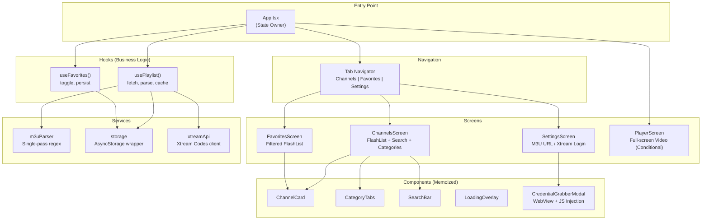

# FOR_ME.md — IPTV Player

## 1. The "Plain English" Abstract

**What does this project do?**

This is a mobile app for your iPhone that lets you watch live TV channels. You give it a URL to an M3U playlist file (basically a big text file listing TV channel stream URLs), and it parses it, shows you all the channels organized by category, and lets you tap to watch any channel. Think of it as **your own custom TV guide + remote control**, but instead of cable, everything streams over the internet.

**Analogy:** Imagine walking into a massive record store where all the music is free. This app is the catalog system — it takes a giant inventory list (the M3U file), sorts everything into genres (categories), lets you search for what you want, and plays the music (video) when you pick something. The store doesn't own the music; it just helps you navigate what's already out there.

---

## 2. The Architecture (Visualized)

We used a **"lifted state" pattern** — all major state lives at the `App.tsx` level and flows down via props. This avoids context/Redux overhead for what's essentially a single-user, single-purpose app.



**Why this structure?**

- **No Redux/Context** — For a single-screen app with a few pieces of state (channels, favorites, current player), lifting state to `App.tsx` is simpler and faster. No provider hell, no selector overhead.
- **Hooks encapsulate logic** — `usePlaylist()` handles fetch → parse → cache → serve. `useFavorites()` handles toggle + persist. The screens just receive data and render.
- **Player as a conditional overlay** — Instead of navigating to a player screen (which adds stack overhead and transition delay), we conditionally render `PlayerScreen` over everything when a channel is selected. This makes channel launch feel *instant*.

---

## 3. The "War Stories" (Crucial Learning)

### Bug #1: FlashList v2 API Breaking Change
- **Symptom:** TypeScript errors on `estimatedItemSize` prop in both list screens
- **Root Cause:** FlashList v2.0.2 removed `estimatedItemSize` (it now auto-measures). The prop was required in v1.x, removed in v2.x.
- **Solution:** Simply removed the prop. FlashList v2 handles sizing automatically.
- **Lesson:** Always check the major version of a library you're importing. v1 → v2 often means breaking API changes. Running `npm ls <package>` before using docs from StackOverflow saves time.

### Bug #2: Expo Project Scaffold Conflict
- **Symptom:** `create-expo-app` refused to run because the target directory had an existing `.agent` folder.
- **Root Cause:** The scaffolding tool checks for any existing files and aborts.
- **Solution:** Created the project in a temp directory and copied files over.
- **Lesson:** Expo's scaffolding tools are opinionated about clean directories. When you have existing configs (`.agent`, `.git`, etc.), use the temp-and-copy strategy.

### Bug #3: Xtream Codes Server Timeout Hanging the App
- **Symptom:** Entering an Xtream Codes URL like `http://freeiptv.ottc.xyz/get.php?...` caused the app to hang indefinitely with no way out.
- **Root Cause:** The `fetch()` call had no timeout and no `AbortController`. Dead servers = infinite loading spinner.
- **Solution:** Added 15s timeout for M3U fetches, 20s for Xtream API calls, `AbortController` for cancellation, phased status messages, and a cancel button.
- **Lesson:** **Always add timeouts to network requests.** The default `fetch()` timeout is basically infinity. Also: auto-detect Xtream URLs in M3U paste fields and route them through the proper API flow.

### Bug #4: `VideoPlayer.replace()` Freezing the UI on iOS
- **Symptom:** Switching channels froze the UI for 1-3 seconds. Console spammed: *"On iOS `VideoPlayer.replace` loads the asset data synchronously on the main thread..."*
- **Root Cause:** `player.replace()` is synchronous on iOS — it downloads asset metadata on the main thread, blocking everything. Even expo-video's own docs say it will be deprecated.
- **Solution:** Switched to `player.replaceAsync()` (async, loads off the main thread). Also added a 15-second stream timeout, retry/skip buttons on error, and `isSwitching` guard to prevent double-taps.
- **Lesson:** **Always check if an API has an async variant before using the sync one.** Especially on mobile where the main thread = the UI thread. One synchronous network call = the whole app locks.

### Bug #5: Channel Switch Always Shows Error/Retry Screen
- **Symptom:** Tapping "Next Channel" almost always triggered the error overlay saying "Stream Unavailable" — even for channels that work fine.
- **Root Cause:** **Two interacting problems.** (1) When `replaceAsync` interrupts a previous load, the old stream's abort fires a `statusChange: 'error'` event. This stale error from the *old* stream gets applied to the *new* stream. (2) The `isSwitching` guard on `switchChannel` was never reset on error, so the "Next Channel" button on the error overlay was permanently blocked.
- **Solution:** Added an `expectedUrl` ref that tracks which URL we intentionally loaded. The `statusChange` listener ignores error events during switching if they don't match the expected URL. Also: abort/cancel errors from `replaceAsync` catch are silently ignored (they're normal during rapid switching). A dedicated `handleSkipNext` function resets `isSwitching` before calling `switchChannel` to break the deadlock. Bonus: added a "Back to Channels" button on both error *and* buffering overlays — users should never be trapped.
- **Lesson:** **Asynchronous state transitions create stale-event bugs.** When source A → source B, events from source A can arrive *after* you've set state for source B. Always track "which thing am I expecting events from" and discard stale ones. This is the async version of a race condition.

### Bug #6: Full Japandi Theme Migration (Colors & Icons)
- **Symptom:** The entire app was dark purple (`#0A0A0F` background, `#6C5CE7` accent) while `design-rules.md` specified a warm, tactile Japandi aesthetic.
- **Root Cause:** Initial theme was built for dark mode before the Japandi design system was established.
- **Solution:** Rewrote `theme.ts` with correct Japandi palette (warm cream `#FAF7F2` background, sage green `#5B7A65` primary, espresso `#3D352E` text). Added warm-tinted shadows via `Platform.select`. Replaced all emoji icons (📺 ♥ ⚙ 🔍 ✕ ♡) with Ionicons across every file. Updated all 10 source files.
- **Lesson:** **Design tokens should be established early.** Migrating a color scheme after the fact touches every single file. If we'd built with the Japandi tokens from day one, this would have been a theme.ts-only change.

### Bug #7: Puppeteer → WebView Pivot for Mobile Credential Grabbing
- **Symptom:** The user had a working Puppeteer scraper for auto-creating IPTV accounts. Needed to integrate it into the Expo/React Native app.
- **Root Cause:** Puppeteer requires a Chromium binary. It physically cannot run on iOS — there's no headless browser runtime available.
- **Solution:** Used `react-native-webview` to load the IPTV site in an in-app modal. The WebView renders the real page (including Cloudflare Turnstile, which solves naturally via real user interaction). We poll the page state via `injectJavaScript()` every 2 seconds, and once the results page is detected, we inject the same `extractIPTVDetails()` extraction logic to grab credentials and send them back to React Native via `postMessage`.
- **Lesson:** **"How would I do this on the server?" is never the right question on mobile.** The equivalent on mobile is almost always "WebView + injected JS." The same extraction logic works in both environments — the difference is just the *vehicle* that runs it.

---

## 4. Tech Decisions & Trade-offs

| Decision | Why | Trade-off |
|---|---|---|
| **expo-video** over react-native-video | Expo Go compatible; no custom dev build needed for testing. Built-in HLS on iOS via AVPlayer. | Less control over player internals. No DRM support (react-native-video has it). |
| **FlashList** over FlatList | Handles 10K+ items with cell recycling at 60fps. FlatList creates/destroys views as you scroll. | Slightly more complex integration; v2 has less documentation than v1. |
| **Lifted state** over Redux/Context | Zero dependency overhead, simpler mental model for a single-user app. | Prop drilling through 2-3 levels. Acceptable at this app's scale. |
| **Set<string>** for favorites | O(1) lookup for `isFavorite()` — called on every FlashList render. Array `.includes()` would be O(n). | Slight serialization cost when persisting (Set → Array → JSON). |
| **Debounced search (300ms)** | Filtering 10K items on every keystroke causes jank. 300ms is the sweet spot between responsiveness and performance. | User perceives a slight delay. Acceptable for the smoothness gain. |
| **Background persistence** | `savePlaylistData()` runs in background (`.catch(console.warn)`) so it never blocks the UI thread after a parse. | On a crash before persist completes, data could be lost. Acceptable for a cache. |
| **NSAllowsArbitraryLoads** | Many IPTV streams use HTTP, not HTTPS. Without this, iOS blocks them silently. | Reduces transport security. Acceptable for a media player app. |

| **Xtream API** via player_api.php | Uses structured JSON endpoints (`get_live_streams`, `get_live_categories`) instead of parsing a massive M3U file. Faster, typed, and supports auth status checking. | More API calls (3 round-trips: auth + categories + streams). Worth it for proper error handling. |

### Intentional Technical Debt
- **No unit tests** — MVP speed. Add Jest when the app stabilizes.
- **No EPG** — Planned for v2. The architecture supports it (just add an EPG service + data to the channel model).
- ~~**Mixed icon strategy**~~ — ✅ **Resolved.** All icons now use `@expo/vector-icons` (Ionicons). No more emoji fallbacks.

| **react-native-webview** for credential grabbing | Lets us reuse the same extraction JS logic from the Puppeteer scraper, but runs it in-app on real pages. Turnstile/CAPTCHA solves naturally since it's a real browser. | Requires user to wait ~10-15s for Turnstile. Not fully automatic. |

---

## 5. The "Senior Engineer" Mindset

### React.memo with Custom Equality (ChannelCard.tsx)
```tsx
const ChannelCard = memo<ChannelCardProps>(
  ({ channel, isFavorite, onPress, onToggleFavorite }) => { ... },
  (prev, next) =>
    prev.channel.id === next.channel.id &&
    prev.isFavorite === next.isFavorite
);
```
**Why it matters:** In a list of 10K items, React will call `shouldComponentUpdate` on *every visible item* during any state change. The default `memo()` does a shallow compare of all props, which would fail on the callback props (new function refs every render). Our custom equality check only compares what *actually triggers visual changes*: channel identity and favorite status. This prevents thousands of unnecessary re-renders.

### Guard Pattern in M3U Parser
```tsx
if (url && (url.startsWith('http://') || url.startsWith('https://'))) {
```
**Why it matters:** M3U files from the wild can contain absolute garbage — relative paths, FTP URLs, empty lines, malformed entries. This single guard clause prevents the entire channel list from being polluted with unplayable entries. **GUARD CLAUSES > TRY-CATCH** for input validation.

### Set for O(1) Favorites Lookup
```tsx
const [favoriteIds, setFavoriteIds] = useState<Set<string>>(new Set());
const isFavorite = useCallback((id: string) => favoriteIds.has(id), [favoriteIds]);
```
**Why it matters:** `isFavorite()` is called on *every item* in the FlashList render pass. With an Array, this would be O(n) per item × n items = O(n²). With a Set, it's O(1) per item × n items = O(n). At 10K channels, this is the difference between instant and "why is my scroll janky."

### Async Channel Switching with Timeout & Recovery
```tsx
// Track which URL we expect — ignore stale errors from interrupted loads
expectedUrl.current = newChannel.url;
await player.replaceAsync({ uri: newChannel.url });
player.play();
```
**Why it matters:** Instead of unmounting the VideoView, we reuse the player instance and swap the source URL via `replaceAsync`. The async version offloads asset metadata loading to a background thread (critical on iOS where the sync `replace()` froze the UI). We track the `expectedUrl` ref so that stale `statusChange` error events from interrupted loads are silently discarded. Abort/cancel errors in the `replaceAsync` catch block are also ignored — they're a normal artifact of rapid switching. We also add a 15-second stream timeout, and the error overlay always includes a Back button so users are never trapped.

### WebView JS Injection for Cross-Context Extraction (CredentialGrabberModal.tsx)
```tsx
// Inject extraction script and receive results via postMessage
webViewRef.current.injectJavaScript(EXTRACTION_SCRIPT);
// ...
const handleMessage = (event: WebViewMessageEvent) => {
    const msg = JSON.parse(event.nativeEvent.data);
    if (msg.type === 'credentials') onCredentialsGrabbed(msg.data);
};
```
**Why it matters:** The extraction logic (`extractIPTVDetails()`) was originally written for Puppeteer's `page.evaluate()`. We adapted it to run identically inside a WebView via `injectJavaScript()`. The key insight: `postMessage` is the WebView↔React Native bridge. We serialize the extracted credentials to JSON, post them via `window.ReactNativeWebView.postMessage()`, and receive them in the `onMessage` callback. Same extraction code, different transport layer. The polling mechanism (`setInterval` + `injectJavaScript`) acts as our "waitForNavigation" equivalent — we check every 2s if the results page has loaded, then trigger extraction.
### Bug #8: The "Nuclear Option" Deleted the Bridge (WebView Communication)
- **Symptom:** Our anti-detection script `delete window.ReactNativeWebView` successfully hid the WebView from Turnstile, but it also permanently broke `postMessage`. The app received zero messages from the injected scripts.
- **Root Cause:** We thought `injectedJavaScriptBeforeContentLoaded` ran *before* everything, but on iOS/WKWebView, the bridge setup (creating `window.ReactNativeWebView`) happens *before* our script runs. So `delete` nuked the bridge object that `react-native-webview` had just created.
- **Solution:** Switched to a **Property Trap**. Instead of deleting the object, we used `Object.defineProperty` to intercept the bridge's creation. We capture the `postMessage` function in a closure (`__origPost`) and then define a getter that returns `undefined` (hiding it from Turnstile). We expose the captured poster via `window.__rnPost`.
- **Lesson:** **Don't just delete globals you don't own.** If a library relies on a global, wrap it or mask it, but ensure the functionality (like `postMessage`) is still accessible via a private reference.

### Bug #9: `innerText` Doesn't Read Input Values
- **Symptom:** The extraction script sent back labels ("IPTV Username") but null values, even though the text was clearly visible on screen.
- **Root Cause:** `document.body.innerText` returns the *text content* of elements. The value of an `<input>` field is a property, not text content. The browser renders it, but `innerText` ignores it.
- **Solution:** Rewrote the extraction logic to `document.querySelectorAll('input')`, then read the `.value` property of each input. We matched inputs to labels by checking key attributes (`id` ↔ `label[for]`, parent text, or placeholder).
- **Lesson:** **Screen scraping is not text parsing.** What you see on screen is a composition of DOM structure and IO properties. Always read form data from form elements, not from the page text representation.
